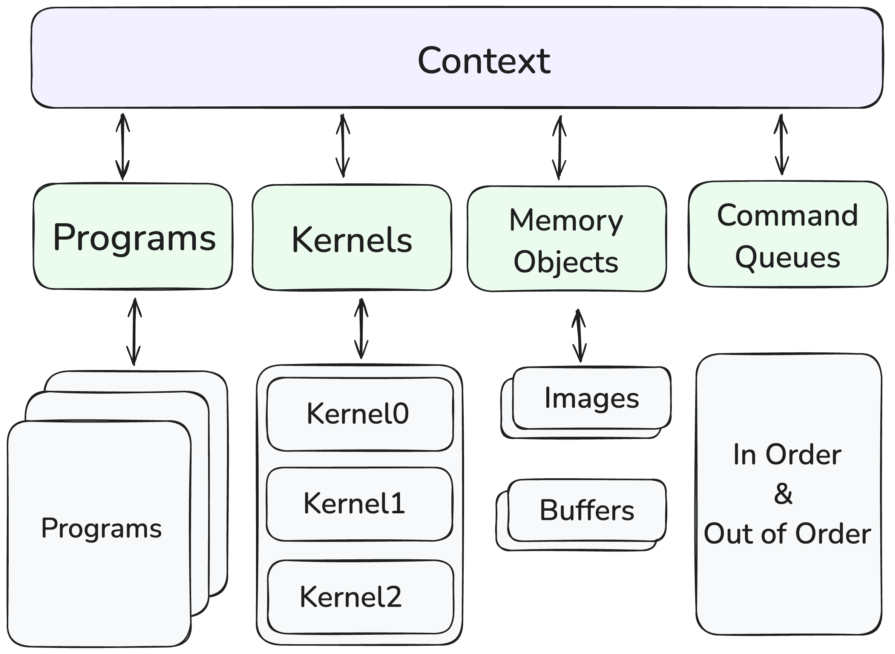
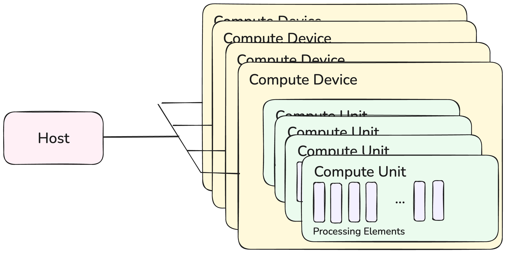
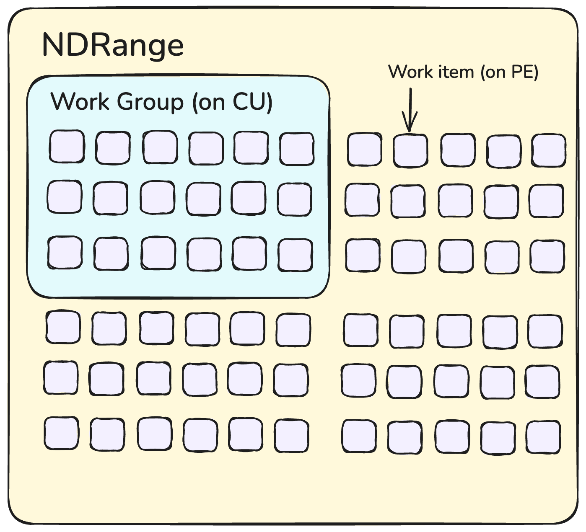
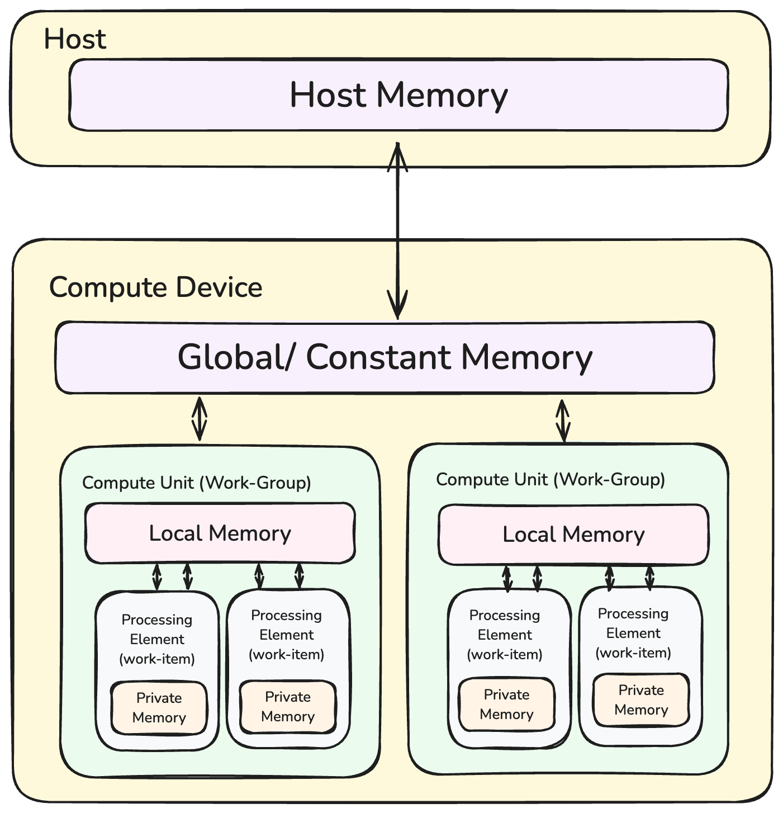

<details>
<summary><span style='font-weight:bold; font-size: 1.4rem;'>Contents</span></summary>
- [How does OpenCL Work?](#how-does-opencl-work)
  - [Executing an OpenCL Program](#executing-an-opencl-program)
  - [Sequence for Executing an OpenCL Program [1]](#sequence-for-executing-an-opencl-program-1)
- [Kernels](#kernels)
- [OpenCL Programming Model](#opencl-programming-model)
  - [Platform Model ](#platform-model)
  - [Execution Model](#execution-model)
  - [Memory Model](#memory-model)
- [OpenCL Programming](#opencl-programming)
  - [Writing the Kernel](#writing-the-kernel)
  - [Sources ](#sources)
</details>

> Skip <a href="#opencl-programming">here</a> if you only care about the code.


- OpenCL stands for Open Computing Language - an open standard for cross-platform, Parallel Programming.
- OpenCL is a *programming framework* and *runtime* that enables a programmer to create small kernel programs (kernels) compiled and executed in parallel on any processor.
- Some Processors Include CPU, GPU, DSP, FPGA, and Tensor Processors.
- Because it works with many types, it is often called a solution for **Heterogeneous Parallel Programming**.

**Definitions:**
- **Platform**: The OpenCL platform is a specific implementation of the standard by individual hardware vendors.
    - One Single Computer may serve several OpenCL platforms/implementations.
    - For example, the Intel Platform supports the CPU, and the GPU is supported by AMD.
- **Device** (or kernel) is an actual hardware device supporting OpenCL.
    - A Device will run its code on 'Computing Units'.
    - e.g. a single core of a modern CPU, which consists of 'Processing Elements'
    - Each Platform can support multiple devices.
- **Contexts**: Multiple devices from the same platform can then be assembled into different 'Contexts', which enable flexible configurations on machines with multiple devices (e.g. 4 GPUs).
- **Queue** is associated with a specific context (i.e., a specific device) and allows a programmer to interact with the device.
    - We send commands to the queue; a command can request a copy operation between the host and the device.
- **Events** - OpenCL enables profiling using events; these are attached to different queue commands and collect info about timings.

## How does OpenCL Work?
OpenCL contains two APIs: 
- The *Platform Layer API* runs on the Host CPU.
	- It discovers what processors or compute devices are available. 
	- We can use this to query what devices we want to run our code on.
- The *Runtime API* compiles kernels for the device.
	- It will also gather the execution results.
### Executing an OpenCL Program
- A Kernel Program is a basic unit of executable code (a function).
- Kernels can execute with **data** or **task-parallelism**. 
- An OpenCL program is a collection of Kernels and functions. 
- A Command Queue is used by the Host Application to send kernels and data transfer functions to a device for execution. 
	- When we enqueue a command onto the queue, it may execute in parallel.
	- It can be executed in-order or out-of-order.
	- A Device may have multiple command Queues.
<details>
 <summary>In-Order vs Out-of-Order Execution</summary>
	**In-Order Execution**: Instructions go through fetch-decode-execute in the order the compiler generates them. Top to bottom, one stalls, and they all stall.
	**Out-of-Order Execution**: Instructions are fetched in the compiler-generated order but they may be executed in a different order, independent instructions can run in parallel and if one stalls the others can still pass.
</details>



### Sequence for Executing an OpenCL Program [1]
1. Query for available OpenCL platforms and devices
2. Create a context for one or more OpenCL devices in a platform
3. Create and build programs for OpenCL devices in the context
4. Select kernels to execute from the programs
5. Create memory objects for kernels to operate on
6. Create command queues to execute commands on an OpenCL device
7. _Enqueue_ data transfer commands into the memory objects if needed
8. _Enqueue_ kernels into the command queue for execution
9. _Enqueue_ commands to transfer data back to the host, if needed
## Kernels
- An OpenCL app is split into host code and kernel code.
- Host code written in C or C++, and Kernel code is written in OpenCL C.
- Kernels can be compiled in two ways:
	- *Online Compilation*: Ingested and Compiled by the OpenCL driver during execution.
	- *Offline Compilation*: the Kernel is pre-compiled into a binary. 
## OpenCL Programming Model
There are three models we need to be aware of:
- The Platform Model
- Execution Model
- Memory Model
### Platform Model 
- The Platform Model describes how OpenCL understands the Compute Resources in a System. 
- A *host* is connected to one or more OpenCL compute devices (CDs).
 - Each CD is a collection of multiple Processing Elements (PEs).
 - Processing Elements execute code with SIMD or SPMD.



A Compute Device could be the GPU.
### Execution Model
The `clEnqueueNDRangeKernel` command allows a single kernel program to be initiated to operate in parallel across a data structure structure. 
- `NDRange` is an N-Dimensional (ND) structure that holds the work items.
- For using a 2D image, the image size would be the `NDRange`, and each pixel is a work-item that a copy of the kernel running on a single processing element will operate on
- We specify a `work-group` size representing groups of individual work items in an NDRange. 
- Work items in the same work group can share local memory.



### Memory Model
Several memory types in OpenCL form a hierarchy:
1. Host Memory - on the host CPU
2. Global/Constant memory - available to all CUs in a CD.
3. Local Memory - available to all PEs in a CU.
4. Private Memory - available to a single PE.



## OpenCL Programming
First, we need to import the necessary libraries:
```cpp
#include <CL/opencl.hpp>
#include <iostream>
#include <fstream>
#include <string>
```
Following the steps from above in our main function: 
1. Query for available OpenCL platforms and devices
```cpp
int main() {
    // Store the Platform ID
    cl_platform_id platform_id;
    // Get the first Available Platform
    clGetPlatformIDs(1, &platform_id, NULL);

    // Optionally: get the name of the platform
    char platformName[128];
    clGetPlatformInfo(platform_id, 
		      CL_PLATFORM_NAME, 
		      sizeof(platformName), 
		      platformName, NULL
		      ); 

    // Store the Device ID
    cl_device_id device_id;
    // Get the first GPU available on a given platform
    clGetDeviceIDs(platform_id, CL_DEVICE_TYPE_GPU, 1, &device_id, NULL);

    // Optionally: get the name of the Device
    char deviceName[128];
    clGetDeviceInfo(device_id, 
		    CL_DEVICE_NAME, 
		    sizeof(deviceName), 
		    deviceName, NULL
		    );

    std::cout << "Current Device is: " << deviceName << std::endl;
	
    std::cout << "Current Platform is: " << platformName << std::endl;

    ...
```
Alternatively, we can get these from a list:
```cpp
    cl::vector<cl::Platform> platformList;
    cl::Platform::get(&platformList);
```
2. Create a context for one or more OpenCL devices in a platform
	-  Contexts manage objects in the OpenCL Runtime:
	- Objects like Command Queues, Memory, Programs, Kernel
	- All the OpenCL work happens in a Context.
	- A context can have multiple devices.

```cpp
    cl::Device device(device_id);
    cl::Context context = cl::Context({ device });
```

3. Create command queues to execute commands on an OpenCL device
	- This is how we push commands onto the device.
	- These are called streams in Cuda.
```cpp
    cl::CommandQueue queue(context, device);
```

4. Next, we define the source of code which will run on the device
	 - This will store the Kernel.
	 - The `Sources` data structure lets us store and manage kernel source code before executing it.
```cpp
    cl::Program::Sources sources;
```

5. Create memory objects for kernels to operate on.
	- \_h stands for host (it is on the host)
```cpp
    int SIZE = 10;
    int A_h[] = { 0, 1, 2, 3, 4, 5, 6, 7, 8, 9, 10 };
    int B_h[] = { 11, 12, 13, 15, 16, 17, 18, 19, 20 };

    // We need to allocate a memory buffer on the device itself (_d is device)
    // A buffer can be of several types:
    // - CL_MEM_READ_ONLY
    // - CL_MEM_WRITE_ONLY
    cl::Buffer A_d(context, CL_MEM_READ_WRITE, sizeof(int) * SIZE);
    cl::Buffer B_d(context, CL_MEM_READ_WRITE, sizeof(int) * SIZE);	
    cl::Buffer C_d(context, CL_MEM_READ_WRITE, sizeof(int) * SIZE);
```
6. _Enqueue_ data transfer commands into the memory objects if needed
	- Writing into Device Memory
	- We can execute commands on a device 
	- We can also initialise vectors A_d using values from A_h
```cpp
    queue.enqueueWriteBuffer(A_d, CL_TRUE, 0, sizeof(int) * SIZE, A_h);
    queue.enqueueWriteBuffer(B_d, CL_TRUE, 0, sizeof(int) * SIZE, B_h);
```

### Writing the Kernel
> kernels.cl
```cl
void kernel simple_add(global const int* A, global const int* B, global int* C) 
{
    int id = get_global_id(0);
    C[id] = A[id] + B[id];
};
```
- Kernels are written in OpenCL C
- A Kernel must return void. 
- The `global` keyword means it is pointing to global memory.
You may also see this written as:
```cl
void __kernel simple_add(global const int* A, global const int* B, global int* C) 
{
    int id = get_global_id(0);
    C[id] = A[id] + B[id];
};
```
These are the same semantically. 
7. Select kernels to execute from the programs
	-  We need to build the kernel by reading it from the given `.cl` file.
	- Then, push it into the source object.
	- We also need a program associated with the source.
	- The Program is then built for a particular device.
	- A **Program** is an OpenCL program consisting of one or more kernels.
```cpp
    // Read the Kernel file as a string
    std::ifstream file("kernels.cl");
    std::string kernel_code((std::istreambuf_iterator<char>(file)),
			        (std::istreambuf_iterator<char>()));
    sources.push_back({ kernel_code.c_str(), kernel_code.length() });

    // Next we create a program which links 
    // the OpenCL code to the context
    cl::Program program(context, sources);

    // Building the Program
    if (program.build({ device }) != CL_SUCCESS) 
    {
	    std::cout << "Error Building: " 
		<< program.getBuildInfo<CL_PROGRAM_BUILD_LOG>(device) 
		<< std::endl;
	    exit(1);
    }
```

8. _Enqueue_ kernels into the command queue for execution
	- Execute the Kernel by Enqueueing it.
	- A program can have many entry points or kernels. 
```cpp
    // Create a Kernel from the program
    cl::Kernel simple_add = cl::Kernel(program, "simple_add");
    // Add all the data as arguments to the kernel
    simple_add.setArg(0, A_d);
    simple_add.setArg(1, B_d);
    simple_add.setArg(2, C_d);

    // - We want to run the simple_add kernel
    // - Global Offset: start kernel from 0 (NullRange)
    // - Global Work Size: How many work-items or threads we run 
    // - Local Work Size: work-group size -> OpenCL chooses the size (NullRange)
    queue.enqueueNDRangeKernel(simple_add, 
			       cl::NullRange, 
			       cl::NDRange(SIZE), 
			       cl::NullRange
			       );
	
```

9. _Enqueue_ commands to transfer data back to the host, if needed
```cpp
    int C_h[SIZE];
    // Read the final buffer
    // - Read from C_d 
    // - Set Blocking or Non-Blocking
    // - Start Reading at 0
    // - Read 4 Bytes * SIZE
    // - Destination pointer (read into)
    queue.enqueueReadBuffer(C_d, CL_TRUE, 0, sizeof(int) * SIZE, C_h);

    // output the final array
    std::cout << " result: \n";
    for (int i = 0; i<10; i++) {
	    std::cout << C_h[i] << " ";
    }
    std::cout << std::endl;
}
```

### Sources 
1. https://github.com/KhronosGroup/OpenCL-Guide/
2. https://www.codeproject.com/articles/92788/introductory-tutorial-to-opencl