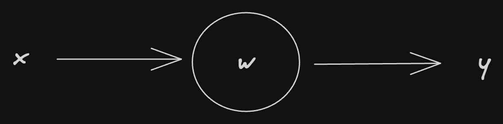
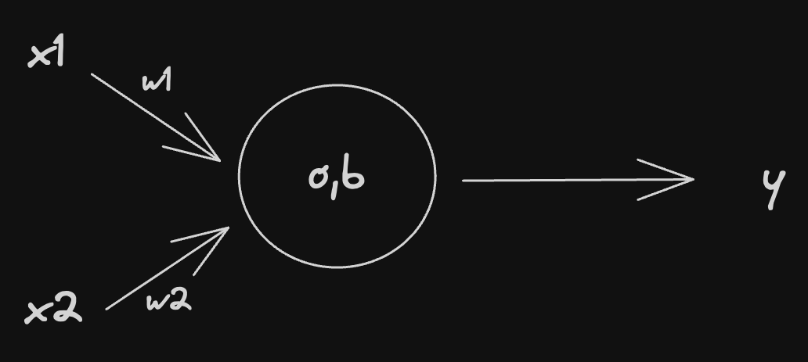
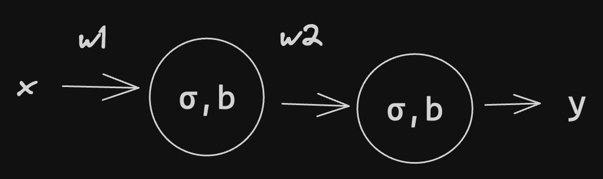
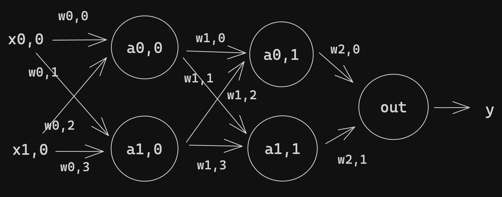

## 1. Linear Model - Perceptron

$$
\begin{align*}
y = xw + b
\end{align*}
$$

## 2. Two Input Model with 1 Neuron

$$ y = (x_1 \times w_1) + (x_2 \times w_2) + b$$
This is then passed through an activation function. This is because the model is not linear and we may need to normalise the values.
$$ y = \sigma(x_1w_1 + x_2w_2 + b) $$
## 3. Two Neuron Model

$$
\begin{align}
a^{(1)} &= \sigma(xw^{(1)} + b^{(1)}) \\
y &= \sigma(a^{(1)}w^{(2)} + b^{(2)})
\end{align}
$$

This is the feedforward algorithm. We take the previous layers and feed them into the next. 
Therefore 

$$
\begin{align}
a^{(n)} = \sigma \left( \sum_{i=0}^nw^{(n)}a^{(n)} +b^{(n)} \right)
\end{align}
$$

Where $a^{(n)}$ is the activation for a given layer. 
## 4. Two Layers with Two Neurons Each

$$
\begin{align}
 a_0^{(0)} &= \sigma ((x_{0,0}\times w_{0,0}) +(x_{1,0} \times w_{0,2}) + b_0)) \\
 a_1^{(0)} &= \sigma((x_{1,0} \times w_{0,3}) + (x_{0,0}\times w_{0,1}) + b_0)) \\
 a_0^{(1)} &= \sigma((a_0^{(0)} \times w_{1,0})+ (a_1^{(0)} \times w_{1,1}) + b_1)) \\
 a_1^{(1)} &= \sigma((a_0^{(0)} \times w_{1,1}) + (a_1^{(0)} \times w_{1,3}) + b_1)) \\
 y &= \sigma((a_0^{(1)} \times w_{2,0}) + (a_1^{(1)} \times w_{2,1})  + b_2)
\end{align}
$$

Sometimes we write $z^i_j$ to represent $\sum_k(w^i_{jk} \times a^{i-1}_k) + b^i_j$.
We can write this in a more concise manner using vectors and matrices for the transition from one layer to the next:

$$
\begin{align}
a^{(0)} =&  \sigma \left(
\begin{bmatrix} 
	w_{0,0} & w_{0,1} \\
	w_{0,2} & w_{0,3} 
	\end{bmatrix} 
	\begin{bmatrix} 
	x_{0,0} \\ 
	x_{1,0} \\
\end{bmatrix} + 
\begin{bmatrix}
 b_0 \\
 b_0
\end{bmatrix}
\right) = \begin{bmatrix}
 a_0^{(0)} \\
 a_1^{(0)}
\end{bmatrix} \\
W^{(0)} &= \begin{bmatrix} 
	w_{0,0} & w_{0,1} \\
	w_{0,2} & w_{0,3} 
	\end{bmatrix}, X = \begin{bmatrix} 
	x_{0,0} \\
	x_{1,0} 
	\end{bmatrix},
	b^{(0)} = \begin{bmatrix} 
	b_{0} \\
	b_{0} 
	\end{bmatrix} \\
	a^{(0)} &= \sigma(W^{(0)}X + b^{(0)})
\end{align}
$$

$$
a^{(1)} = \sigma \left(
\begin{bmatrix} 
	w_{1,0} & w_{1,1} \\
	w_{1,2} & w_{1,3} 
	\end{bmatrix} 
	\begin{bmatrix} 
	a_{0}^{(0)} \\ 
	a_{1}^{(0)} \\
\end{bmatrix} + 
\begin{bmatrix}
 b_1 \\
 b_1
\end{bmatrix}
\right) = \begin{bmatrix}
 a_0^{(1)} \\
 a_1^{(1)}
\end{bmatrix}
$$

$$
y = \sigma(
\begin{bmatrix}
w_{2,0} & w_{2,1}
\end{bmatrix}
\begin{bmatrix}
a_1^{(1)} \\
a_0^{(1)}
\end{bmatrix}
+ b_2)
$$

## 5. Cost Function
A Cost function measures how well a neural network performs with respect to the given training sample and the expected output.
A cost function takes the form:

$$
\begin{align*}
C(W, B, S^r, E^r) \\ \ \\
W = \text{network weights} \\
B = \text{network biases} \\
S^r = \text{Input of a single training sample} \\
E^r = \text{The desired output}
\end{align*}
$$

This function can also possibly be dependent on $y_j^i$ and $z_j^i$ for any neuron $j$ in layer $i$, since those values are dependent on $W$, $B$, and $S^r$.
In Back Propagation, the cost function is used to compute the error of the output layer, $\delta^L$, via 
$$ \delta^L_j = \frac{\partial C}{\partial a^L_j}\sigma'(z^i_j) $$
This can also be written as a vector via
$$ \delta^L = \nabla_aC \ \odot \ \sigma' (z^i)$$
Note that $\odot$ denotes vector product.
To be used in back-propagation, a cost function must:
1. Be able to be written as an average over cost functions $C_x$ for an individual training example, $x$: 
$$ C = \frac{1}{n}\sum_x C_x$$
This allows us to compute the gradient (w.r.t. $W$ and $B$) for a single training example.
2. The cost function $C$ must not be dependent on any activation values of a network besides the output values $a^L$.
### 5.1 Cost Functions ($C_x$)
#### 5.1.1 Quadratic Cost
Also known as Mean Squared Error:
$$ C_{MSE}(W, B, S^r, E^r) = 0.5 \sum_j(a^L_j - E^r_j)^2$$
The gradient of this cost function is the differentiated version:

$$
\begin{align}
C_{MSE}(W,B,S^r,E^r) &=  \frac{1}{2}\sum_j(a^L_j - E^r_j)^2 \\
C'_{MSE}(W,B,S^r,E^r) &=  \left(\frac{1}{2}\sum_j(a^L_j - E^r_j)^2\right)' \\
C'_{MSE}(W,B,S^r,E^r) &=  \frac{1}{2}\left(\sum_j(a^L_j - E^r_j)^2\right)' \\
C'_{MSE}(W,B,S^r, E^r) &= \frac{1}{2}\sum2(a^L-E^r) \\
\therefore \text{for some sample } r \\
\nabla_aC_{MSE} &= (a^L-E^r)
\end{align}
$$

#### 5.1.2 Cross-Entropy Cost
Also known as Bernoulli Negative Log-Likelihood and Binary Cross-Entropy. 
$$ C_{CE}(W,B,S^r, E^r) = - \sum_j[E^r_j \ln{a^L_j} + (1 - E^r_j)\ln{(1-a_j^L)}]$$
Therefore, the gradient is:

$$
\begin{align}
 C_{CE} &= - \sum_j[E^r_j \ln{a^L_j} + (1 - E^r_j)\ln{(1-a_j^L)}] \\
  C'_{CE}&= \left(- \sum_j[E^r_j \ln{a^L_j} + (1 - E^r_j)\ln{(1-a_j^L)}]\right)' \\
C'_{CE} &= -\sum_j \left[E_j^r \frac{1}{a_j^L} + (1 -E_j^r) \frac{1}{(1-a_j^L)}\right]' \\
C'_{CE} &= -\sum_j \left[\frac{E_j^r}{a_j^L} + \frac{(1 -E_j^r)}{(1-a_j^L)}\right]' \\
C'_{CE} &= -\sum_j \left[\frac{E_j^r}{(a_j^L)(1-a_j^L)} + \frac{(1 -E_j^r)}{(a_j^L)(1-a_j^L)}\right]' \\
C'_{CE} &= -\sum_j \left[ \frac{E_j^r + (1 -E_j^r)}{(a_j^L)(1-a_j^L)}\right]' \\
\\ &\text{w.r.t to one sample r:} \\
C'_{CE} &= -\sum_j \frac{(a^L -E^r)}{(a^L)(1-a^L)} \\
\end{align}
$$

Other Cost functions:
- Exponential Cost 
- Hellinger Distance
- Kullback-Leiber Divergence
- Generalised Kullback–Leibler divergence
- Itakura–Saito distance

Loss functions help a model determine how wrong a prediction is, which helps the learning algorithm to decide how to minimise it.
- MAE, MSE and RMSE are used for Regression
- Binary Cross Entropy is used for classification.
## 6. Computing the Gradient 
### 6.1 Gradient Descent
Gradient Decent or Hill-Climbing is the principle by which learning happens. We want to reduce the loss, drive down the loss function, and essentially find the turning point. 
$$ \text{New Weight} = \text{Old Weight}- \text{a small change in W}$$
$$W_{new} = W_{old} - \Delta W$$
To do this, we compute the gradient at each point and move in the opposite direction, driving you to the minimum point. 
- We find $\Delta W$ by differentiating the loss function.
- We set a limit on the amount by which a weight can change: the **learning rate** ($\eta$).
	- The lower the learning rate, the lower the weight change. 
$$\Delta W = \eta \times \frac{\partial e}{\partial w}$$ 
#### 6.1.1 Types of Gradient Descent
1. **Batch Gradient Descent**: passing the entire data set and calculating the average loss. This is slow and memory-intensive.
2. **Mini-Batch Gradient Descent**: we define batch sizes, say n, n randomly chosen values are selected, and the cost is computed for those data points. 
3. **Stochastic Gradient Descent**: weights are updated after every record; it's quick and less memory intensive but has high volatility, meaning it may take longer to converge to a minimum.
### 6.2 Calculate the Gradient
There are many ways to compute a gradient, one example is Finite-Difference or Back Propagation.
#### 6.2.1 Finite-Difference
$$
\begin{align*}
C'(w) = \lim_{\epsilon \to 0} \frac{C(w + \epsilon) - C(w)}{\epsilon}
\end{align*}
$$

## 7. Activation Functions 
Activation functions are mathematical operations which are applied to the outputs of individual neurons in a neural network. 
- They introduce nonlinearity 
- Allow the network to capture intricate patterns. 
- Allow it to learn more complex relationships. 
- Help generalisation.
- Avoids vanishing and exploding gradients - certain functions like tanh and sigmoid help mitigate vanishing gradients. 
- ReLu prevents exploding gradients.
### 7.1 Types
1. Sigmoid: $f(x) = \frac{1}{(1 + e^{-x})}$, ranging from 0 to 1 
	1. Used in the output layer of binary classification
2. Hyperbolic Tangent: $\tanh = \frac{e^{x} - e^{-x}}{e^x + e^{-x}}$ inputs range from $[-1, 1]$ 
3. ReLu: $f(x) = \max{(0, x)}$ often used but suffers from the dying ReLu problem.
4. Leaky ReLu: $f(x) = \max{(\alpha \times x, x)}$ allows a small gradient for negative values to solve the dying ReLu issue.
5. Exponential Linear Unit (ELU)
	
	$$
	\begin{align}
	f(x) = \begin{cases}
	x \text{ if } x> 0 \\
	\alpha(e^x - 1) \text{ otherwise}
	\end{cases}
	\end{align}
	$$

	1. Combines Leaky ReLu and ReLu to mitigate the dying ReLu issue.
6. Swish Activation: $f(x) = x \times \sigma(x)$ proposed by google gives a smoother behaviour
7. Parametric ReLu (PReLu)
8. Randomised Leaky ReLu (RReLu)
9. Parametric Exponential Linear Unit (PELU)
10. Softmax - muti-class classification 
11. Softplus
12. ArcTan
13. Gaussian Error 
14. Swish-1 Activation 
15. Inverse Square Root Linear Unit (ISRLU)
16. Scaled Exponential Linear Unit (SELU) 
17. SoftExponential 
18. Bipolar Sigmoid 
19. Binary Step Activation
### 7.2 Usages
**1. Sigmoid:** Sigmoid activation is well-suited for binary classification problems where you need outputs that resemble probabilities. It squashes input values into the range between 0 and 1, making it ideal for problems with two distinct classes.

**2. Tanh (Hyperbolic Tangent):** Tanh is an excellent choice for hidden layers, especially when your input data is centred around zero (mean-zero data). It maps input values to the range [-1, 1], which helps mitigate the vanishing gradient problem and is often preferred in recurrent neural networks (RNNs).

**3. ReLU (Rectified Linear Unit):** ReLU is a widely used activation function and serves as a good default choice for most situations. It introduces sparsity by setting negative values to zero, making it computationally efficient. However, it may lead to dead neurons during training, so it’s crucial to monitor its performance.

**4. Leaky ReLU:** Leaky ReLU is a variant of ReLU and is employed when the standard ReLU causes neurons to become inactive. It allows a small gradient for negative values, preventing the issue of dead neurons. It’s a recommended alternative to standard ReLU.

**5. ELU (Exponential Linear Unit):** ELU is valuable when you want the network to capture both positive and negative values within the hidden layers. It addresses the dying ReLU problem and can lead to faster convergence during training.

**6. Swish:** Swish is an activation function worth experimenting with, as it combines the computational efficiency of ReLU with a smoother, non-monotonic behavior. It has shown potential performance improvements in some architectures.

**7. PReLU (Parametric ReLU):** PReLU extends Leaky ReLU by allowing each neuron to learn its optimal alpha parameter. This can be beneficial when you want the network to adapt its activation function during training.

**8. RReLU (Randomised Leaky ReLU):** RReLU introduces randomness as a form of regularisation during training. It can help prevent overfitting and enhance the network's generalisation ability.

**9. PELU (Parametric Exponential Linear Unit):** PELU extends ELU by enabling neurons to learn their alpha parameter. This flexibility can be advantageous in various scenarios, allowing the network to adapt to the data.

**10. Softmax:** Softmax activation is essential for multi-class classification problems in the output layer. It transforms a vector of real numbers into a probability distribution over multiple classes, enabling the network to make class predictions.

**11. Softplus:** Softplus is a smooth approximation of ReLU and can be helpful when you need a smooth activation function with continuous and differentiable derivatives.

**12. ArcTan:** ArcTan squashes input values to a limited range between -π/2 and π/2. It can be suitable for specific applications where you must restrict the output within this range.

**13. GELU (Gaussian Error Linear Unit):** GELU is popular in transformer models and combines a smooth function with Gaussian noise, potentially leading to improved model performance.

**14. Swish-1:** Swish-1 is a variant of Swish with a division operation. It offers a different activation profile compared to standard Swish and is worth considering in experimentation.

**15. ISRLU (Inverse Square Root Linear Unit):** ISRLU is a smooth alternative to ReLU that can be helpful when maintaining smooth gradients throughout the network.

**16. SELU (Scaled Exponential Linear Unit):** SELU encourages automatic activation normalisation and can lead to better training performance, especially in deep neural networks.

**17. SoftExponential:** SoftExponential introduces nonlinearity with a learnable parameter, allowing the network to adapt to specific data distributions.

**18. Bipolar Sigmoid:** Bipolar Sigmoid maps inputs to the range between -1 and 1, which can be beneficial when you want to model data with positive and negative values.

**19. Binary Step:** Binary Step is the simplest activation function, providing binary outputs based on a specified threshold. It’s suitable for binary decision problems.

## 8. Chain Rule and Partial Derivatives
The chain rule is used to differentiate complex functions.

$$
\begin{align}
h(x) &= (\sin x)^2 \\ 
\frac{dh}{dx} &= \frac{d[(\sin x)^2]}{d[\sin x]} \times \frac{d[\sin x]}{dx} \\
\frac{dh}{dx} &=  2\sin x \times \cos x
\end{align}
$$

More Generally:

$$ 
\frac{d}{dx}f(g(x)) =f'(g(x)) \times g'(x)
$$

For example:

$$
\begin{align} 
\frac{d}{dx}[5x+3]^4 \\
g(x) &= 5x + 3 \\
f(x) &= x^4 \\
f'(x) &= 4x^3 \\
g'(x) &= 5 \\
\frac{d}{dx}[5x+3]^4 &= f'(g(x)) \times g'(x) \\
&= 4[5x+3]^3 \times 5 \\
& = 20[5x +3]^3
\end{align}
$$

### 8.1 Partial Derivatives
Used in multivariable calculus
$$
\begin{align}
f(x,y) &= x^2 +y^3 \\
\frac{\partial f}{\partial x} &= 2x + 0 \\
\frac{\partial f}{\partial y} &= 0 + 3y^2
\end{align}
$$

First, we treated y as a constant and then x.
## 9. Back Propagation
> Backpropagation repeatedly adjusts the weights of the connections in the network so as to minimise a measure of the difference between the actual output vector of the net and the desired output vector.

The Gradient of a function $C(x_1, x_2, \dots, x_m)$ is a vector of partial derivatives:
$$ \frac{\partial C}{\partial x} = \left[\frac{\partial C}{\partial x_1},\frac{\partial C}{\partial x_2},\dots,\frac{\partial C}{\partial x_m}\right] $$
- The derivative of a function C measures the sensitivity to a change in the function value (output value) with respect to a change in its argument x (input value). In other words, the derivative tells us the direction C is going.
- The gradient shows how much the parameter x needs to change (in the positive or negative direction) to minimise C
For a single weight on layer l ($w_{j,k}^{(l)})$ the gradient is:

$$
\begin{align}
\frac{\partial C}{\partial w_{j,k}^{(l)})} &= \frac{\partial C}{\partial z_j^{(l)}} \frac{\partial z^{(l)}_j}{\partial w_{j,k}^{(l)}} \\
\text{where } z^{(l)}_j &= \sum_{k=1}^m w_{j,k}^{(l)}\times a^{(l-1)}_k + b_l \\
\frac{\partial z_j^l}{\partial w_{j,k}^{(l)}} &= a^{l-1}_k \\
\frac{\partial C}{\partial w_{j,k}^{(l)}} &= \frac{\partial C}{\partial z^{(l)}_j}a_{k}^{(l-1)}
\end{align}
$$

This uses $\partial^{(l)}_j = \frac{\partial C}{\partial z^{(l)}_j}$ the local gradient

### 9.1 Derivatives of Activation Functions
**Sigmoid**

$$
\begin{align}
\sigma (x) &= \frac{1}{1 + e^x} \\
\sigma'(x) &= \sigma(x)(1-\sigma(x))
\end{align}
$$

## 10. Optimisation
### 10.1 Stochastic Gradient Descent
The issue with gradient descent is that it is very computation-heavy.
- We need to compute the derivative with respect to each feature.
- So, with 10,000 data points and 10 features, we are doing this 100,000 times.
- This makes it very slow for large datasets.
**Stochastic** Gradient Descent is a random gradient descent:
- We randomly pick a data point from the whole dataset at each iteration.
- This reduces the computations needed.
##### Mini-Batch
In Mini-Batch, instead of looking at one data point, we sample a small number of data points. 
### 10.2 Learning Rate 
- Learning Rate influences the step size or how the model changes in response to error.
- Too small of an LR could lead to it getting stuck, and large values could lead to training being too fast and thus unstable (converging too quickly). 
- The learning rate tends to be in the range of $(0.0, 1.0)$ 
- Controls how quickly it adapts.
#### 10.2.1 Learning Rate Decay 
With learning rate decay, the learning rate is calculated at each update (e.g. end of each mini-batch) as follows:
$$lrate = initial\_lrate \times \left(\frac{1}{(1 + decay \times iteration)}\right)$$
Where _lrate_ is the learning rate for the current epoch, _initial_lrate_ is the learning rate specified as an argument to SGD, _decay_ is the decay rate which is greater than zero and _iteration_ is the current update number.
#### 10.2.2 Learning Rate Scheduler 
A learning rate scheduler is a method that adjusts the learning rate during the training process, often lowering it as the training progresses.
There are several schedulers for example:
1. Step Decay
2. Exponential Decay
3. Cosine Annealing
#### 10.2.3 Adaptive Learning Rate
Different Methods exist that adapt the learning rate to the problem.
- AdaGrad
- Adam
- RMSProp
### 10.3 Momentum 
Momentum can smooth the progression of the learning algorithm that, in turn, can accelerate the training process.
- It is common to use momentum values close to 1.0, such as 0.9 and 0.99.
- Since SGD converges randomly, momentum is used to remove this random aspect.
- Using all previous updates, the momentum at time ‘t’ is calculated, giving more weight to the latest updates compared to the previous update in order to speed convergence
- Momentum makes SGD faster.

$$
\begin{align}
v_t = \beta v_{t-1} - \eta \nabla L(w_t) \\
w_{t+1} = w_t + v_t 
\end{align}
$$

Where 
- $w_t$​: Weights at iteration $t$
- $\eta$: Learning rate
- $\nabla L(w_t)$: Gradient of the loss function with respect to weights
- $v_t$: Velocity (tracks the moving average of gradients)
- $\beta$: Momentum coefficient (commonly $\beta \in [0.9, 0.99]$)
**Why?**
- **Faster Convergence**:
    - Momentum reduces oscillations along steep gradients (e.g., in narrow valleys) by dampening the effect of gradients that alternate in direction.
    - It helps the optimiser gain speed along flatter dimensions of the loss surface.
- **Escape from Local Minima**:
    - By incorporating past updates, momentum can help the optimiser "push through" small local minima or saddle points.
- **Stability**:
    - Momentum smooths the optimisation path, leading to a more stable and predictable learning process.
## 11. Data
### 11.1 Data Shuffling
It is useful to shuffle the training data during training. 
1. **Preventing Bias**: Without shuffling, the model might learn patterns based on the order of the data, leading to biased training and potentially poor generalisation to unseen data.
2. **Randomness in Batch Selection**: When training in mini-batches, shuffling ensures that each batch contains a diverse set of samples from the dataset. This randomness helps the model learn more effectively and prevents it from memorising specific patterns within a batch.
3. **Improving Generalisation**: Shuffling the data helps to ensure that the model generalises well to unseen data by exposing it to a variety of samples during training. This can lead to better performance on validation and test datasets.
4. **Breaking Patterns**: In some cases, the dataset might have inherent patterns based on the order of samples (e.g., temporal or spatial patterns). Shuffling disrupts these patterns, forcing the model to learn more robust features.
5. **Avoiding Overfitting**: Shuffling helps to mitigate overfitting by preventing the model from memorising the specific characteristics of the training data, which may not generalise well to new data.
### 11.2 Data Batching 
A batch defines how many samples to work through before making any updates to parameters.
This is useful for:
- computational efficiency 
- paralellisability
- Helps with memory management
- **Gradient Smoothing:** By averaging gradients across a batch, training becomes less noisy
- Smaller batches create a regularisation effect.
